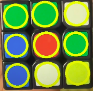

### Why this blog?
This blog is mainly written for two reasons:
1. As a personal reference in future.
2. A kind of guideline for people who want to understand my code - [Github](https://github.com/hwaseem04/cube-color-extractor).

### What I used ?
1. Python
2. OpenCV<br>
...thats all

### File structure explanation:
1. `main.py`: All sort of main functionalities like reading video frame from camera, edge detection, morphological operation, bounding box detection, drawing circles, capturing color ranges etc are done here. 
2. `hsv_color_range.py`: 
    * After detecting the bounding box(of smaller square in a cube face), inorder to find out the color present in a bounding box I picked up HSV color values manually and stored in this file. 
    
    * It also has function to determine the color value, provided the average HSV values.
3. `utilities.py`: As of now few usable utilities are available. I need to modularise my code sooner for better readability.

### How I approached the problem:
* Initially I thought of finding a bigger bounding box capturing the whole cube's front face(The face shown to camera) and then finding bounding box of smaller squares(9 squares). But I found this quite difficult because of poor edge detection.

* So then I shifted my thought process to directly capturing the smaller squares of the cube face shown at the camera and then found out colors at each squares and plotted them.

### Important code snippets explanation:
Most of the codes like reading video frames, converting color space are self explanatory. Though I will be commenting the code extensively in near future for better readability. In this blog I will go through few place where I feel it is important to understand. Lets begin with the `while` loop in `main.py`. I avoid mentioning line numbers from code files, as I might modify them in future.

```python
annotless_frame = frame.copy()
```
The reason for creating a copy of original frame is, I will be annotating the original frame, i.e by drawing cicles over it to detect 9 small squares. I dont want the annotation to interfere while calculating the average of the HSV values inside the 9 bounding boxes, for which I am using a clean `annotless_frame`. The code where I annotate the main frame is below,
```python
cv2.circle(frame,(int(rec[0][0]), int(rec[0][1])), int(rec[1][0]/2), (0,255,255), 10)
```

Next part is about plotting the colors of each cube face. `count` is integer variable keeping track of the count of cube face plotted. Max value of count is 5, if count = 1 it means first face is plotted, if count = 6 it means last face is plotted. `mean_clr` is the immediate list of captured 9 HSV values. That is, it holds the HSV color values of the 9 squares of the cube face recently captured by pressing `e`.
```python
for i in range(count):
    if i > 5:
        break
    frame = draw_small_cube(i, frame, mean_clr)
if count < 6:
    cv2.rectangle(frame,mapping[count][0], mapping[count][1],(0,0,255),10) 
```

Count is Incremented when user presses letter `e`(Snippet present at end of file)

```python
if cv2.waitKey(60) & 0xFF == ord('e'):
    count += 1
    if count > 6:
        small_cube_color_maps = {0: [], 1: [], 2: [], 3: [], 4: [], 5: []}
        count = 0
```

`small_cube_color_maps` variable is vital for plotting. It is just a dictionary that holds 9 colors of small squares of each cube face. So it is a dictionary of 6 key-value pair to hold colors of each cube.

```python
## Initialised at the beginning of the file
count = 0
small_cube_color_maps = {0: [], 1: [], 2: [], 3: [], 4: [], 5: []}
```
It is needed because `mean_clr` variable holds only the immediate captured 9 sqaure colors, but we also need to have all previously captured cube face's colors. You might have noticed in the [demo video](https://www.youtube.com/watch?v=lPK9oIrQoyA) after capturing new cube face, the exisiting cube face drawn still holds the colors inspite of `imshow` showing newly read frame at each instant. So essentially all the *so far* captured cube faces are plotted on each frame. You can find code snippet for that at the end of `draw_small_cube` function (in for loop) in `main.py`.

```python
for cube_index in range(0, (count+1)): 
    try:
        cv2.rectangle(frame, (p1[0], p1[1]) , (p5[0] + 80, p2[1] + 80)  ,small_cube_color_maps[cube_index][0],-1) 
        cv2.rectangle(frame, (p2[0], p2[1]) , (p5[0] + 160, p3[1] + 80)  ,small_cube_color_maps[cube_index][1],-1)
        cv2.rectangle(frame, (p3[0], p3[1]) , (p6[0]      , p6[1])       ,small_cube_color_maps[cube_index][2],-1) 

        cv2.rectangle(frame, (p5[0], p5[1]) , (p7[0] + 80, p7[1])  ,small_cube_color_maps[cube_index][3],-1)
        cv2.rectangle(frame, (p5[0] + 80, p5[1]) , (p7[0] + 160, p7[1])  ,small_cube_color_maps[cube_index][4],-1)
        cv2.rectangle(frame, (p5[0] + 160, p5[1]) , (p8[0], p8[1])  ,small_cube_color_maps[cube_index][5-i],-1) 

        cv2.rectangle(frame, (p7[0], p7[1]) , (p10[0], p10[1])  ,small_cube_color_maps[cube_index][6-i],-1)
        cv2.rectangle(frame, (p7[0] + 80, p7[1]) , (p11[0], p11[1])  ,small_cube_color_maps[cube_index][7-i],-1) 
        cv2.rectangle(frame, (p7[0] + 160, p7[1]) , (p12[0], p12[1])  ,small_cube_color_maps[cube_index][8-i],-1)
    except Exception as e:
        print("Cube index: ",cube_index)
```

Next comes the most important and challenging and at the same time **fun part**, i.e preprocessing the image --> Edge detection, morphological operations (Dilation, erosion etc) and findingContours. If you are not familar with these terminologies I suggest you to read OpenCV's documentation. They are pretty good.
1. [morphological operation](https://docs.opencv.org/4.x/d9/d61/tutorial_py_morphological_ops.html) 
2. [canny edge detection](https://docs.opencv.org/4.x/da/d22/tutorial_py_canny.html)
3. [finding Contours](https://docs.opencv.org/4.7.0/d4/d73/tutorial_py_contours_begin.html)

Code I used:
```
gray = cv2.cvtColor(frame, cv2.COLOR_BGR2GRAY)

gray_blur = cv2.GaussianBlur(gray, (5,5), 4)
edges = cv2.Canny(gray_blur, 30,55)

kernel1 = cv2.getStructuringElement(cv2.MORPH_RECT,(5,5))
kernel2 = cv2.getStructuringElement(cv2.MORPH_RECT,(3,3))

dilation = cv2.dilate(edges,kernel1,iterations = 3)
erosion = cv2.erode(dilation,kernel2,iterations = 5)

contours, hierarchy = cv2.findContours(erosion, cv2.RETR_TREE, cv2.CHAIN_APPROX_SIMPLE)
```

Grayscale images are preferred for edge detection. I am also blurring the image to reduce the noise in the input frame. I am picking two kernels of size 5 by 5 and 3 by 3. **I had no specific reason in choosing them in this way. Just an trial and error way.** Pick ones that satisfies you. Then I apply dilation(kind of Enhancing white pixels) and erosion(reducing intensity of white pixel at boundaries). Similary it is also done on **trial and error basis**. I wish I had better ways to do it :(. After that I find all the contours.

To be frank, in my entire code implementation, these particular steps were time consuming. It took me lot of iterations to emperically arrive at this value of interations and kernel size.  But still I haven't attained a proper noise free eroded frame :(. *Need to work on edge detection and kernel iterations*.

Contors alone in not sufficient to find the bounding box of the small squares(to detect 9 squares of each cube face) I need. I need to look for contours that form squares and are not too large or small(in terms of area). For which I did the following:

```python
for i in contours:
    approx = cv2.approxPolyDP(i, 0.1*cv2.arcLength(i, True), True)
    if (len(approx) != 4):
        continue
    rec = cv2.minAreaRect(i) # center, (width, height), angle of rotation
        
    # Small squares
    if (rec[1][0] * rec[1][1] > 8000) and (rec[1][0] * rec[1][1] < 18000):
        ratio = float(rec[1][0])/rec[1][1] # width / height

        if ratio >= 1.15 or ratio <= 0.88: 
            continue
        print(rec[1][0] * rec[1][1])
        RR.append(rec)
```
This code is quite self explanatory. The `cv2.approxPolyDP()` function approximates the contors to smallest polygon. If the number of vertices is `!=4` then definitely it won't be a square. 

I need rectange(every square is a rectangle), so I use `cv2.minAreaRect()` function to find the best **smallest rectangle** that encloses the contour. Then I set contraint for the area of the rectangle, so that to avoid large/small bounding box(which doesn't belong to the cube) is captured. Ratio of length and width is constrained with little flexibilty for capturing square bounding boxes alone.

Now what you have left with is **(in ideal case)** 9 captured bounding boxes of each squares in a cube face that is shown at the camera.(since I had drawn circle, so bounding is represented as cirlce)

<div align="center">
    
</div>

### Conclusion
I tried best to cover the important aspects of my code. If you have any clarifications or improvement tips in terms of edge detection or anything please reach out to me on [linkedin - hwaseem04](https://www.linkedin.com/in/hwaseem04/).

Video-Demo: [here](https://youtu.be/lPK9oIrQoyA)<br>
Github-Link: [here](https://github.com/hwaseem04/cube-color-extractor)