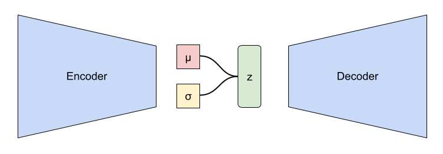

> **Disclaimer**: It would be suffice if you read the blog as such. If you are interested you can also toggle the **"expand"** option and read in-depth reasoning/derivations below.

 

### Little introduction to VAEs
VAEs are class of Generative models that is structured in form of encoder compressing the input distribution of images to a latent space distribution (usually Unit Gaussian) of much smaller dimension and decoder using the sampled variables from the distribition to generate new data samples that look very similar to the input distribution as a whole.

Consider the above image. Consider an image passing through encoder, i.e applying series of  convolution operations. Since we want the latent space variables to be distributed as unit gaussian, the encoder outputs mean **vector** ($$ \vec{\mu} $$) and standard deviation **vector** ($$ \vec{\sigma} $$) of some smaller dimension (say 2 dimensional vector for simplicity)

<!-- > Why not Mean and Covariance matrix? -->

> Why we are forcing the latent space to be in unit gaussian?

    
    

        
Expand

        

            
 People also use other distributions like von Mises-Fisher distribution etc, but Unit Gaussian as a prior is widely used for a reason that it helps in deriving a simple KL divergence equation in the loss function. To get an idea of the derivation, click the <b>Expand</b> toggle under Loss function section.

        

    

    

 

Reparametrization trick is used to generate samples from the latent space which is passed on to decoder to get new images. Essentially decoder is learning a mapping from latent space distribution to complex manifold(some high dimensional space).

### Loss function

$$ \text{VAE Loss} = \text{Reconstruction Loss} + \text{KL Divergence Loss} $$ 

$$ \text{Reconstruction Loss} = \frac{1}{N} \sum_{i=1}^{N} \| x_i - \hat{x}_i \|^{2} $$

$$ \text{KL Divergence Loss} = -\frac{1}{2} \sum_{j=1}^{J} (1 + \log(\sigma_j^2) - \mu_j^2 - \sigma_j^2) $$

<!-- 
$$ \text{L}_{\text{VAE}} = \mathbb{E}_{q(z|x)}\left[\log p(x|z)\right] + \text{KL}\left(q(z|x) \,||\, p(z)\right)
 $$

 $$
\text{L}_{\text{VAE}} = \mathbb{E}_{z \sim q}\left[\log p(x|z)\right] +  \text{KL}\left(q(z|x) \,||\, p(z)\right)

$$ 

$$  
   f(x) = \log p(x|z) 
$$ 

$$
   \mathbb{E} [x] = \mathbb{E}_{q} [x] = \mathbb{E}_{x \sim q} [x] = \int x .\, q(x) \, dx 

 $$ -->

<!-- \mathbb{E} [f(x)] = \mathbb{E}_{q} [f(x)] = \mathbb{E}_{x \sim q} [f(x)] = \int f(x) \, q(x) \, dx  -->
<!-- $$ \text{KL Divergence Loss} = \frac{1}{N} \sum_{i=1}^{N} -\frac{1}{2} \sum_{j=1}^{J} (1 + \log(\sigma_{ij}^2) - \mu_{ij}^2 - \sigma_{ij}^2) $$ -->

> Derivation of KL Divergence Loss

    
    

        
Expand

        

            
  You can refer to this useful stack exchange discussion: <a href="https://stats.stackexchange.com/questions/318748/deriving-the-kl-divergence-loss-for-vaes/370048#370048 ">StackExchange</a>

            
 If interested on generic derivation: <a href="https://stats.stackexchange.com/questions/7440/kl-divergence-between-two-univariate-gaussians">Univariate Case</a>, <a href="https://stats.stackexchange.com/questions/60680/kl-divergence-between-two-multivariate-gaussians">Multivariate Case</a> 

            
        

    

    

 

> Another form of reconstruction loss with log likelihood

    
    

        
Expand

        

            
 Another notation people use in literature to describle reconstruction loss is with log likelihood. i.e 

               $$ \text{Reconstruction Loss} = -\mathbb{E}_{z \sim q(z|x)}\log(P (x | z)) $$ 

            Generally in VAE, the output of the decoder is considered to have the mean $$\mu_{x|z}$$ which I will just call &mu; and people usually assume a unitary covariance (assuming the features to be independant of each other for simplicity, i.e diagonal covariance matrix). So in that case we have:

            $$logP(x|z)=-\frac{1}{2}[log(|\Sigma|)+klog(2\pi)+(\mathbf{x}-\mathbf{\mu})^T(\mathbf{x}-\mathbf{\mu})]$$

            This comes from taking the log of the pdf of a multivariate Gaussian distribution (It is considered as Gaussian distribution because the samples <b>z</b> are obtained by reparametrising from unit gaussian). Now you can see that since the first two terms are constant with respect to &mu;, the optimization problem is equivalent to  
            
            $$-\frac{1}{2}(\mathbf{x}-\boldsymbol{\mu})^T(\mathbf{x}-\boldsymbol{\mu})$$ 
            
            which is the just the L2 loss between <b>x</b>  and &mu;. 
             
             
            <b>Note: </b> You may have the doubt that in the original MSE loss we use input and reconstructed image in the loss function whereas here we are using the <b>mean</b> and input image for reconstruction, aren't they different? Think about this
            , the output of the decoder is considered probabilisticly as mean vector (same dimension of that of input image), essentially if we reshape it, it will become a reconstructed image. So both interpretations are valid.
             
        

    

    

 

### Reconstruction loss
It is just the mean squared loss. With which we are aiming to make the generated image as close as possible to the input image pixel wise. That is penalising the model if it deviate too much from the input **structure**.

> Why do we need Reconstruction loss

    
    

        
Expand

        

             
        

    

    

 

### KL loss
Here comes the main topic of discussion. 

<!-- **TL DR;** -->
- Using KL Divergence loss helps acheiving;the following properties
    - **Continuity**: Latent variables closer in the latent space are also closer (i.e similarly looking) after decoding.
    - **Completeness**: Latent variables are closely placed in latent space, creating a smooth (gap less) space for meaningfull decoding.

 
- Think of this as a regularisation. We usually regularise in deep learning models to avoid models overfitting the dataset, in other words we want to prevent the model learning shortcuts to learn the underlying given dataset and generalise well for any similar dataset. 
- Similary here, we want to prevent the encoder from learning any random distribution in a particular way which is not robust in nature to generate new samples. 
- When we force the encoder to generate mean and standard deviation as a unit gaussian, we are making it easier for decoder to sample new images uniformly from the latent space.

 
Let me explain you with example of what I mean by *"making it easier for decoder to generate robust new images"* .

The first plot is a 2-D latent space of MNIST images trained without using KL divergence loss term in the loss function. Look carefully the x and y scale, since we didnt force the encoder to generate latent variables following unit gaussian distribution the mean, variance and the range of scales are arbitar because of which the scales are different in x and y direction. 

Below is the recontruction of the latent space to MNIST-images. I am uniformly sampling the latent variables in x-range: (0, 20), y-range: (-7.5, 7.5), so as to utilize the entire latent space above.

Similary I am doing the same procedure after training VAE with KL divergence in the loss term (with unit gaussian prior, i.e mean=0, standard deviation=1). Here I am sampling the latent variables in x-range: (-2.0, 2.0), y-range: (-2.0, 2.0), so as to utilize the entire latent space.

You can form few conclusions regarding the latent space and reconstruction images of the above two cases.
- The latent space without KL divergence loss term is discontinuous, in other terms it doesn't satisfy **completeness**, i.e there are gaps and are not closely packed.
- If you look at the reconstruction image (with KL divergence term) from left to right there is a *smooth* transition of digit images that are closer to each other. For instance 0 looks similar to 6 , 1 looks similar to 7 and so on. But this pattern is not found in the reconstruction image without using KL divergence, which doesn't satisfy **continuity** property. 
- The above two properties are very useful in many ways to get desired good looking outputs from generative model, explanation of which will be out of scope of this blog. If you are interested, you can read about disentanglement in VAEs.

<!-- Toggle to show why unit gaussian is used  -->

 

I know you won't be satisfied or you might be doubtful of my results above. Ofcourse thats natural, here is the [notebook](https://github.com/hwaseem04/Playing-with-Generative-Models/blob/main/VAE.ipynb) you can freely explore with and convince yourself.

 

*Tip*: 
Load the notebook in kaggle, you dont need to install anything locally and can save space :)

### Conclusion
We had a brief introduction to VAE and the loss functions used in standard VAE. We also looked into the two useful properties acheived via using KL divergence in the loss term.

If you have any clarifications/improvements, feel free to reach out to me in [Linkedin](https://www.linkedin.com/in/hwaseem04/)