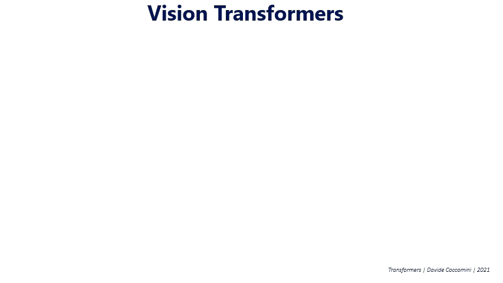

### Why this Blog
I participated in a challenge organised in a Computer Vision conference organized in IIT Jodhpur, India. Though I was not able to secure top 3 positions, I was among the top 10. 

<br>

Over the course of challenge I had the opportunity to build my knowledge dictionary and also learnt quite some pitfalls. I just want to have them documented so that it would be a good look up place for my future self and it might also help anyone out there.

<br>

Code Repository: [Github](https://github.com/hwaseem04/Writer-Verification-Challenge-NCVPRIPG)

<br>

### What is the challenge about
Given two hindi hand writing image, the task of the model is to determine whether it is written by same writer or different writer. Moreover this challenge is writer independant, that is you are not guranteed that you will get handwritten images of same writers which are used in training. 

<br>

So your model must learn well in a way such that it should be able to distinguish any unseen handwriting as whether it is written by same writer or different writer.

<br>

#### Sample Images
**Sample Pair for same writer:**<br>
Image 1


<br>

Image 2


<br>

**Sample Pair for different writer:**<br>
Image 1


Image 2


<br>

You can already get an idea of the difficulty in this problem
- The number of words/lines in the image isn't fixed.
- I haven't provided the entire dataset, but there also exist images which just have single digit/ single word with which we have to verify the handwriting.

<br>

### How did I approach the challenge
Since the number of words in the pair of images to be verified are not same, I thought it would be better if I build a model on word level verification rather than sentence level.

<br>

So I devised a two stage pipeline where stage one will produce word images extracted from each image for all writers in training set. Then in stage two, all the patches are appropriately paired, so that I have similar and dissimilar pairs which is used for metric learning.

<br>

**Architecture:**

<br>


### Brief Intro to Vision Transformers

<br>


<div style='text-align: center'>
    Source: <a href="https://commons.wikimedia.org/wiki/File:Vision_Transformer.gif">wikimedia</a>
</div>

<br>

Vision transformers (a.k.a ViT) introduced in this [paper](https://arxiv.org/abs/2010.11929) revolutionised computer vision community with a simple modification from the original [transformers](https://arxiv.org/abs/1706.03762) idea.
- Decoder from original transformer is replaced with a MLP head that performs classification.
- In original transformers, they dealt with word tokens. But with images in ViT, they came with an minimalisitc, yet effective idea of tokens as fixed sized patches (typically 16 by 16 dimension). 
    - Think in this way, your original image (whatever size it may be), is splitted into fixed size patches (image analogy of word tokens). Which is then used by the Vision transformer.
- Rest of the architecture with Multi-head self attention and other details remain the same in the plain ViT.

<br>

The idea in ViT is that your input image is splitted into fixed size tokens (i.e patches), which are linearly transformed onto vectors and are hence processed by multi-head self attention mechanism in the encoder. 

<br>

- There are two ways in which the output from the encoder (i.e set of processed tokens) can be processed for final classification output. 

    1. In original publication of ViT (corresponding to the GIF above), they had additional class token (similar to the one in BERT architecture) prepended, which is only used for classification by passing it through MLP layers.

    2. But little later, the original authors made few changes in which they discarded the class token and took average pooling.
     You can refer to this [literature](https://arxiv.org/abs/2205.01580) for better clarity.

<br>

Point to note is that, now there exist lot of modified version of ViT with better performance, for instance [Swin](https://arxiv.org/abs/2103.14030), [FlexiVit](https://arxiv.org/abs/2212.08013) etc where each trying to overcome certain drawbacks in plain ViT. Anyway I sticked with plain ViT for the sake of this challenge.

<br>


### PyTorch Collate function

**Motivation to use collate**

<br>

In typical/plain ViT implementation, the image size is usually fixed as 256 by 256 (Assuming grey scale images). When dividing into patches of 16 by 16 we would get 256 tokens (256/16 * 256/16). The number of tokens would be fixed across batches, for instance if the batch size is 2 then the shape of each batch would be (2, 256, 256) (i.e batch size, total tokens, dimension of each token).

<br>

But this isn't the case for my application, where the image can be of varied size. So when converting them into tokens will render different number of tokens each time. For instance, number of tokens for image size 48 by 48 will be 9, 32 by 32 will be 4 etc.

<br>

Dataloaders by default can't handle this kind of different dimensional inputs. Hence we need to explicitly make the dimension same atleast across the batches.

<br>

Lets see a working code example.

<br>

**Code example without collate**

<br>

Before anything, install `einops` library. This is very handy when dealing with multi-dimensional arrays. Visit [here](http://einops.rocks/) to learn more about einops.
```bash
pip install einops
```

<br>

Lets import necessary packages for the minimalistic simulation. I am also creating a Custom dataset resembling my architecture's input requirement. 

```python
import torch
import numpy as np
from einops import rearrange
import torch.nn as nn
from torch.utils.data import DataLoader, Dataset

class Data(Dataset):
    def __init__(self, files_pair1, files_pair2, labels):
        super().__init__() 
        self.files_1 = files_pair1
        self.files_2 = files_pair2
        self.labels = labels
        self.patch_size = 16
    
    def __len__(self):
        return len(self.files_1)
    
    def __getitem__(self, idx):
        img1 = self.files_1[idx]
        img2 = self.files_2[idx]
        
        img1_patches = rearrange(img1, 'c (h h1) (w w1) -> (h w) (h1 w1 c)', h1=self.patch_size, w1=self.patch_size)
        img2_patches = rearrange(img2, 'c (h h1) (w w1) -> (h w) (h1 w1 c)', h1=self.patch_size, w1=self.patch_size)
        concatenated_patches = torch.concatenate([img1_patches, img2_patches], axis=0)
        
        label = self.labels[idx]
        return concatenated_patches, label
             
```

<br>

For simplicity, I am creating random arrays that simulates gray scale images (as in the architecture diagram above). Below, I have arrays of shape (1,48,48) and (1,32,32) which can be assumed as grey scale image with dimension 48 by 48 and another grey scale image with dimension 32 by 32. Ofcourse there are random and are not meaningful. But for the sake of illustration it would suffice.

<br>

Essentially, when image with dimension (1, 48, 48) splitted into tokens of size 16 by 16, we will have 9 tokens (which is `N` in the above architecture figure). When image with dimension (1, 32, 32) splitted into tokens of size 16 by 16, we will have 4 tokens (which is `M` in the above architecture figure). Then they are concatenated and returned in the dataloader's `__getitem__`. 

<br>

```python
img_array1 = [torch.from_numpy(np.random.rand(1, 48, 48)), torch.from_numpy(np.random.rand(1, 48, 48))]
img_array2 = [torch.from_numpy(np.random.rand(1, 32, 32)), torch.from_numpy(np.random.rand(1, 48, 48))]
labels = torch.tensor([1.0,0.0])
data = Data(img_array1, img_array2, labels)
```

<br>

Lets try to pass them into dataloader with batch size as 2. The dataloader returns a iterator of training images and corresponding output. We can get the output of the iterator using `for loop` as well, but I am sticking to the below method. 

<br>

In my case, when batch size is 2, the dataloader should read two entries from `img_array1` and corresponding pair from `img_array2` and have to return it.

<br>

```python
train_loader = DataLoader(data, batch_size=2)
next(iter(train_loader))
```

<br>

**Output:**


<br>

But this plain attempt throws error, the error says the dimension of whatever is returned in `__getitem__` of dataloader has to be same. But in our case, when processing first pair, the output dimension is (13, 256) and when processing second pair, the output dimension is (18, 256) *(Refer below figure for better clarity of what I mean)*. Hence we somehow need to pad the first pair's output with zeros to match both the dimensions to (18, 256).

<br>


<br>

In general, given a batch we find out what is the maximum token length present in it. And we zero pad the output with lesser tokens based on it.

<br>
Lets get the code done.

<br>

**Code example with collate**
```python
def custom_collate(batch):
    # batch is a list (length of this list = batch size), where first entry is concatenated image patch, 2nd entry is label
    max_length = max([ele[0].shape[0] for ele in batch])
    
    final_input = []
    labels = []
    for token, label in batch:
        ele = np.concatenate([token, np.zeros((max_length - len(token), token.shape[1]))])
        final_input.append(ele)
        labels.append(label)
    
    return final_input, labels

```

<br>

When the collate function is passed along the dataloader, whenever dataloader attempts to return training samples, **each batch** is first passed through the collate function, which pads zero and makes the dimension same **through out the batch**. And the output of the collate function is what then returned by the dataloader.

<br>


<br>

```python
train_loader = DataLoader(data, batch_size=2, collate_fn=custom_collate)
next(iter(train_loader))
```

<br>

**Output:**


<br>

Now it doesn't show any error. And the dataloader can be used for training.

<br>

### Masked Self-Attention 

<br>

If you are completely new to the concept of self-attention I would highly suggest reading [Jay Alammar's blog on Transformers](http://jalammar.github.io/illustrated-transformer/)

<br>

Lets see what is masked self-attention. It is the same self-attention mechanism but applied in a restrictive manner. The reason why I thought for such restriction is because I concatenated patches corresponding to two word images. So it seemes feasible for me to apply self-attention only among the tokens of the particular image, rather than to all tokens.

<br>

Let me be more clear, consider the below image.

<br>


<br>

Assume yellow tokens, blue tokens correspond to tokens of first and second image respectively which are concatenated before passing into Vision transformer. In the left, happens the typical Self-Attention where every token attends to each other token parallely, achieving global attention.

<br>

Towards the right is the masked self-attention, where I am restricting the self-attention to happen only with the tokens of same image. That is, tokens 1, 2, 3, 4 wouldn't interact with tokens 5, 6, 7, 8 but attends to themselves. 

<br>

This is what I meant by masked self-attention. The reason why I tried masked self-attention is because I thought attending to same image tokens would be more meaningful rather than attending to the tokens of the other image in the pair. But for some reason, though being intuitive, it didn't give drastic boost to the performance of the model. So I ended up using normal self-attention mechanism in my final version of the code.

<br>

### Generic Remarks

<br>
My main aim from this challenge was to learn, because that was the time I was new to Vision Transformers, so I thought to get my hands dirty while learning it. But later I learnt I could have done the challenge a little better.

<br>

**Things I wish I knew at the beginning of the challenge**
- **Usage of pretrained weights**: Pretrain weights are good starting point not just when the tasks are similar. I had the misconception that the pretrain weights of, say, imagenet would not work well for tasks like this with handwritings. But it turned out when I tested MaskDino with Pretrained ResNet as backbone. To my surprise, it boosted the performance really well. 

- **Shouldn't have to worried on resizing**, atleast in this task: As I said before I later tested with Mask Dino with ResNet backbone, where ResNet is a CNN based model which requires fixed input size unlike ViT. So I had to resize the input images (Not as words patch, but as original whole image). But still after resizing it didn't affect the performance.

- **Occam's Razor**: *The simplest hypothesis is preferable to one that is more complex. Ofcourse this might depend from one situation to other. But if I had to start this challenge again, I would rather start from an existing state-of-the-art architecture that is simple to run and debug. And then add complexity to the model, whether it be ViT or CNN based vision model. 

<br>

<!-- 
### Conclusion and Acknowledgement
<br>
I hope my learnings, and pitfalls that I went through would help you navigate well in your future works.

 Anyway I enjoyed working on this challenge, though I didn't spend my entire time in this challenge as I had my internship work on priority at [CVIT](https://cvit.iiit.ac.in/) research lab at IIIT Hyderabad, I spent 2-3 hour consistently after my internship work for this challenge.

<br>

I should also acknowledge that I got wonderful advise and idea suggestions from seniors at CVIT lab, IIIT Hyderabad.

<br> -->

### Further Reading Materials
I am separately sharing the links that I mentioned in this blog;
1. Jay alammar's [Illustrated Transformer](http://jalammar.github.io/illustrated-transformer/) - To understand Self Attention
2. [Einops](http://einops.rocks/) - To understand the features in this library.
3. Original ViT [paper](https://arxiv.org/abs/2010.11929)
4. Little modifications to original ViT paper - [literature](https://arxiv.org/abs/2205.01580). This boosted performance in Vanilla ViT itself.
