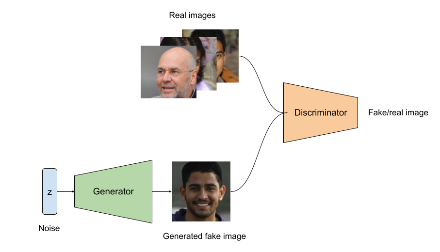
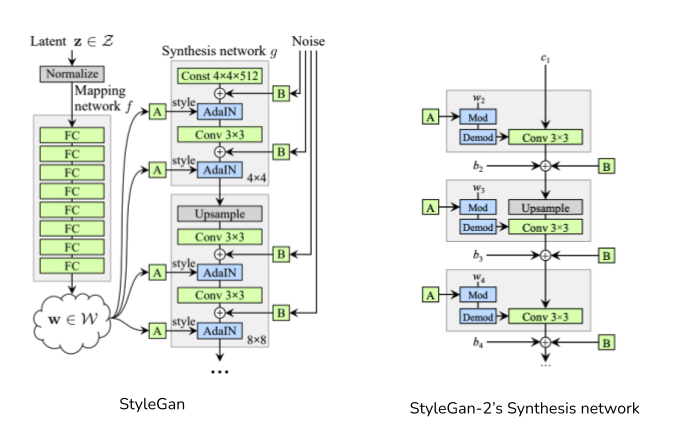
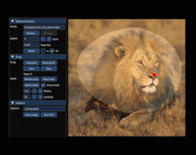
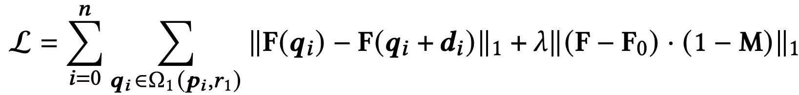
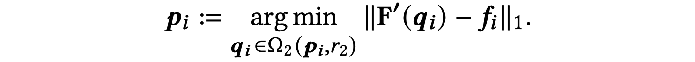
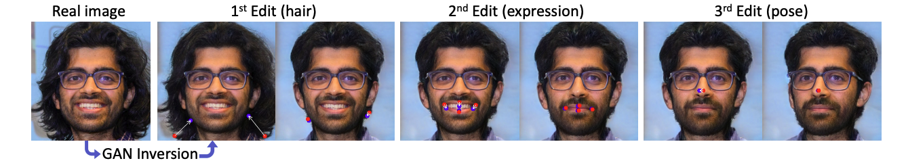
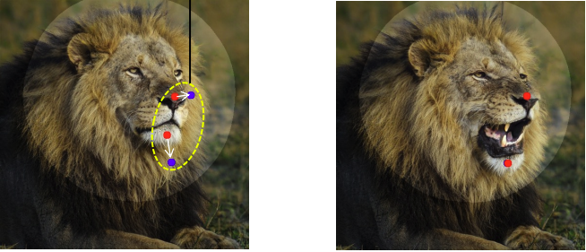
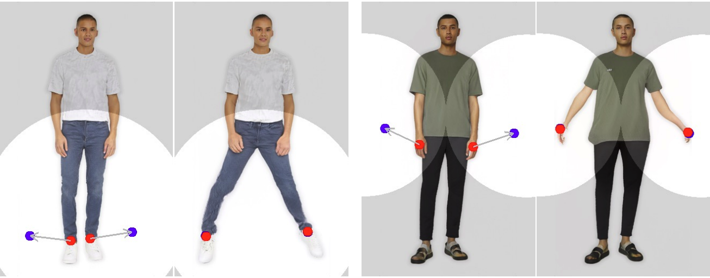

### Introduction

The idea of picking source (a.k.a handle) points and target point in a image and moving the semantic positions(face, nose, leg, hand etc) in the source point to the target location is amazing. Moreover the results were more realistic. 

Whenever I wish to read a new research paper, I often search for video/blog material online to get a clean overview of the topic before reading the actual paper indepth. But for Drag GAN, I was able to see a lot of blogs and videos explaining how to use the GUI rather than giving a better overview of its underlying mechanism. This blog is aimed to provide such a brief, yet useful, overview of Drag GAN's Architecture, the underlying idea and how it is achieved.

### Architecture

Drag GAN utilises StyleGAN-2 framework. But before that what is a GAN?

(Fun fact - all the above images are artificially generated images from [here](https://this-person-does-not-exist.com/en))

GANs (Generative adversarial Networks) are a class of generative models that learn in a minimax fashion. It has a generator and a discriminator. The discriminator is used as a classifier that labels whether the input image is real or fake. The generator learns to produce realistic image from random noise (usually from a unit gaussian distribution). At each optimisation the generator tries to fool discriminator whereas the discriminator learns to find the fake images better (i.e in a minimax fashion). Then how is an equilibrium achieved in this kind of learning? When the discriminator returns probability close to 0.5 for both real and fake images then we can say the model achieved/reached Nash-equilibrium. In game theory, Nash-equilibrium is reached when actions of one player won't change depending on the opponent's action.

Coming back to StyleGan-2 which is used in Drag GAN is an improvment of StyleGan-1. The main focus/modification of the StyleGan architecture from the original GAN lies in the Generator where the discriminator remains the same. 

Since StyleGan's focus is on generator alone, the above figure corresponds to its generator. StyleGan2 is what that is used in DragGan and its difference can be viewed from the above figures in terms of its synthesis network. Explaining StyleGan is beyond the scope of this blog, but I am interested in giving the intuition for the mapping network in StyleGAN.  

Typically in GANs, the generator generate image using a latent vector as input (say 512 dimensional latent vector z). In case of StyleGan the original latent vector z from latent space (Z) is mapped to another space (W) of dimension 512 using a series of Fully connected layers. 

The idea that is claimed in the paper is that, after mapping the latent space(Z) to W space, the vectors 'w' in the W space are more disentangled which means changing a single feature(out of the 512 dimension) will affect only one real attribute (it might be smile or pose or hair color etc). This gives more freedom and richness while editing/manipulating generated images.

### The Idea of Drag GAN

    

 

Drag GAN allows interactive point based manipulation of images resulting in customised realistic images. If you want to move the nose position of a person, select it interactively as the handle (a.k.a source point) and select a target point. After few iteration the position of nose moves from source to target location without distorting the realistic nature of the image.

Though it seems to be a complicated mechanism it is just two simple idea effectively utilised. Drag Gan's interactive point based manipulation solves two subproblems;
1. Motion Supervision
2. Point tracking

This is achieved without any additional networks which adds up to the efficiency of the model performance. The intermediate features of the generator (i.e synthesis network in StyleGAN) is discriminative in nature. That is, it learns features in such a way so that it is able to differentiate between different category of images. This property of "features being discriminative in generator" is utilized effectively by both Motion supervision and Point tracking mechanism. 

**In each iteration of the optimization step the following occurs;**
- Original latent code `w` is optimized to get `w'` which produces new image `I'`. 
- `I'` is a slight modication of `I` where the corresponding semantic positions around the handle point move towards the target point. 
- The exact length of motion of the handle point is not known due to the complex dynamics. Because we are dealing in the `W` space, so we really cant say how much movement of the handle point will be observed in output image space if we change the position of `w` to get `w'` in W space.
- Original handle point position (say (x,y)) in image `I` will now be in different position (x', y') in image `I'` (which is obtained via `w'`). Think of it like this - Lets assume the user want to move the hand of a human from center of image to right corner of image. That is, in original image the hand is somewhere in the middle of the image. Let the handle point be selected on the hand and target point be selected somewhere near the right end of the image. In the new image `I'` the hand move towards the right side. This doesn't happen in one go, it takes several iteration - ideally 30-200. We need to track this new position of the hand at each iteration so that in subsequent iterations we properly move the hand and not any other attributes/semantic features.
- This tracking is achieved via nearest neighbour search.

Lets get into detail of both the subproblem.

### Motion Supervision
If you look in the above GIF, the user selects red point (handle point) and blue point (target point). The aim of the motion supervision mechanism is to move the objects in the small region of handle point towards the target point region without distorting the original image's appearance. Additionally the user can provide a binary mask (a region) which forces the model to move semantic features without affecting the appearance of objects/textures outside the binary mask region. This happens in several iteration and not a one step optimization process.

Motion supervision is not explored much in earlier studies, the authors propose a loss function that can do the motion of handle points towards the target points. StyleGAN's synthesis network has several blocks/layers, each block progressively producing higher resolution images, where the final block's output is the desired generated image. The output of the intermediate blocks can also be called as feature maps. It is said in the original StyleGAN paper that the feature maps after the 6th block has a good tradeoff between resolution and discriminativeness; i.e
- Lower blocks - has features that are useful for the discriminative property
- Higher order blocks - has more resolution 

The obtained feature map from the output of 6th block of the synthesiser is obviously lower in dimension to that of the original generated image. So it is resized via interpolation to match the actual generator's output image size.

Let $$p_i$$ be the handle point and $$\Omega_1(p_i, r_1)$$ be set of points $$(x_i, y_i)$$ that lies in the radius of $$r_1$$ from $$p_i$$.
Let $$F(q_i)$$ be feature value at pixel position $$q_i$$ of 6th block's interpolated feature map, where $$q_i \in \Omega_1(p_i, r_1) $$. Let $$F_0$$ be original feature map (i.e original output image corresponding to `w`). Let $$M$$ be the binary mask of shape same as that of the output image shape. The loss function for motion supervision is proposed as below;

The two summations corresponds to the first term. Lets break it down. In the first term $$d_i = \frac{p_i-t_i}{\| p_i-t_i \|}$$ is the normalized vector(or unit vector) that connects target point($$t_i$$) from handle point($$p_i$$). The first term attains its minimum only when $$d_i=0$$, which happens when handle point coincides with target point. Which is what we want right? i.e move the semantic positions(small patch) near the handle point to target point. Then why do we need the second term? Remember that I mentioned there is option to provide a binary mask which forces model to restrict moving the region outside the binary mask. If the user selects face of the cat alone with the mask, i.e region inside the face corresponds to 1s and region outside the face in the binary mask would be 0s. In the second term, reconstruction loss is used to avoid movement in the non-mask region by penalising any changes in the pixel values outside the binary mask. So only the face of the cat will move and not its body.

With this loss, backpropagation is done to update the `w` which now updates to `w'`. If you look in the StyleGAN architecture above, `w` is passed to several block, not just to the initial block (like in original GAN). It is not necessary to update all the `w`, rather it would be suffice to update the `w` that is passed through the 6th block or below as they are responsible for altering the attributes (smile, hairstyle, etc). Whereas later layers/blocks in synthesiser are responsible for altering appearance which we are not interested currently. 

### Point Tracking
From the above motion supervision step we get `w'`. `w'` generates new image `I'` by passing it through synthesis network. Now the handle point position must have moved to some other location in the new image `I'`. This has to be tracked so that in subsequent optimisation steps the original handle point is properly moved towards to target. This tracking is done via nearest neighbor search. 

Let $$f_i = F_0(p_i)$$ be the feature value of original handle point coordinate $$p_i=(x_i, y_i)$$ in the feature map $$F_0$$ corresponding to `w`, $$F'$$ be the new feature map (corresponding to `w'`), $$\Omega_2(p_i, r_2)$$ be a set of points forming a small patch around the original handle point $$p_i$$'s position in the new feature map $$F'$$ with radius $$r_2$$. 

The point $$q_i$$ corresponding to the minimum value in the above expression, such that $$F'(q_i)$$ is closest to $$f_i = F_0(p_i)$$, is obtained in the new feature space $$F'$$ which is the new position of the handle point.

With this new handle point, the next optimization step begins by using `w'`, `I'` as the starting point. If the user select multiple handle-target point pair, the optimization step can be applied using each points seperately.

### What can we do with Drag GAN
Drag GAN can be used in the following ways;
1. Can be used to edit real images. By GAN inversion technique, the real image can be converted into latent code `w` and then the optimization step can be performed by selecting more than one pair of handle and target points inorder to edit the image as desired by the user.

2. Can be used in synthesising new images by having fine grained control of its apperance.
3. The model is good at hallucinating occluded semantic objects, for example you can open the mouth of the lion(or any other for the purpose) in a image that has its mouth closed. It shows the teeth which is originally occluded.

There are plenty of sources online that explains how you can set up Drag GAN, so I dont wish to explain it here.

### Limitations and Scope of improvement
Authors have listed out few limitations in the paper;
1. Even though the model is good at dealing with out-of-box-distribution (say hallucinations of occluded objects etc) it still produces unrealistic output images when we try to manipulate objects in a way that doesn't correspond to the semantic features in the original training image distribution.
    - Lets say our dataset contain images of humans without stretching out their hands/legs. When we try to move the legs and hands sideways with the help of handle and target points it produces unrealistic outputs/artifacts. You can clearly see the weird bending of hands and legs below.

    

2. This is the most concerning thing. We are still at the dawn of generative modelling, I am sure in the future we will have more sophisticated image editing models that is accessible my more common people. Misuse of the tool to create fake semantic features (fake smile/fake laugh/fake pose etc) can pose serious social issues. 

Every action should have an equal and an opposite reaction, whenever the advancement progresses towards such sythetic generation/modification of images there must also be works that deals with identifying such images. 

### Conclusion

I hope you got a clear overview of the underlying mechanism in this paper. I still didn't include many details of the paper in this blog to avoid overwhelming the readers. The main aim is just to give an overview. With this you can better understand the original Drag GAN paper. 

If you have any doubts/clarifications please send a message in [Linkedin](https://www.linkedin.com/in/hwaseem04/). *Most of the figures are used from the respective original papers.*

References:
1. [Drag Your GAN](https://arxiv.org/pdf/2305.10973.pdf)
2. [Style GAN](https://arxiv.org/abs/1812.04948v3)
3. [Style GAN2](https://arxiv.org/abs/1912.04958v2)
