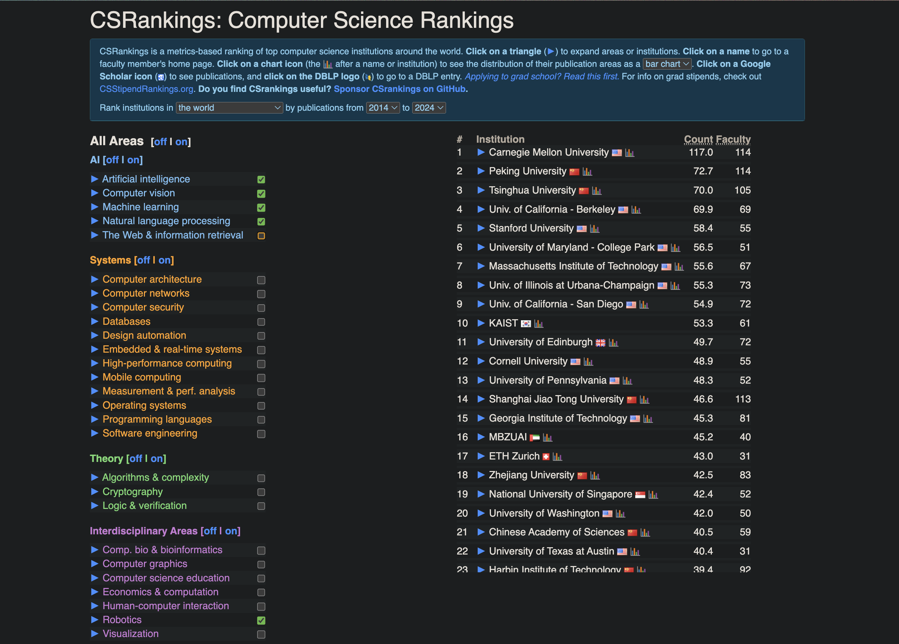

### What you can expect from this blog:

 

- [What is UGRIP](#what-is-ugrip)
- [Selection Process](#selection-process)
- [My Experience](#my-experience)
- [Takeaways](#takeaways)
- [Conclusion](#conclusion)

 

I will try to keep this blog as short as possible, straight to the point.

 

### What is UGRIP:
Before that, Why **Mohamed Bin Zayed University of Artificial Intelligence** (MBZUAI)? 

 

Currently MBZUAI is ranked **16th** (AI, ML, CV, NLP, Robotics combined) surpassing several world class institutes:

 

 

UGRIP is MBZUAI's flagship research internship program for undergraduates. 

 

This internship spans four weeks (yes, it is short, but I have something to say in the [Takeaways](#takeaways) section).

 

It is fully funded!
- Your roundtrip flight fare, health insurance, and cultural activities tickets (more about this in [My Experience](#my-experience)) are covered.
- You get free accommodation in University dorm.
- You will be provided with a generous stipend. It might vary, so I am not mentioning it here, but it will be more than sufficient to cover day-to-day living expenses.

 

For more details, visit the official [website](https://mbzuai.ac.ae/ugrip/).

 

### Selection Process:

 

UGRIP 2024 is only its second cohort, but it is increasingly popular and competitive. Out of thousands of applicants globally, 45 undergraduate students were selected this year.

 

Typically, students in their penultimate year are chosen. However, I also saw a few second-year students (approximately two) in this year's cohort. So yes, give it a try; you have nothing to lose.

 

Applications typically start in January and end by late February. The required documents are already clearly mentioned on the website, so I won't repeat them here.

 

Having a high GPA, a decent amount of prior AI project experience, and a good SOP could help you land this internship. This is something I realized after interacting with others selected for this year's cohort. Take it with a pinch of salt.

 

### My Experience:

 

I would say this internship was the best experience I have ever had in terms of research experience, networking, and enjoying life.

 

Hence, I would like to split my experience into three subsections:
- Research Experience
- Networking Experience
- Weekends

 

#### Research Experience
On the orientation day, we were pitched nine projects (last year it was around six), with three projects from each of the ML, CV, and NLP departments.

 

We were asked to pick three projects in order of priority. We were then assigned projects based on our preferences. Most of us got our top preferred ones, but it can't be guaranteed.

 

I chose to work under [Prof. Zhiqiang Chen](https://zhiqiangshen.com/) on *Optimizing Prompts for Foundation Models*. I had a couple of reasons for choosing this project:

 

- I predominantly had my background in computer vision, but in the long term, I wish to work on multi-modal models. Hence, I wanted to shift to NLP.
- Why specifically on prompts? In my other internship at [CVC](https://www.cvc.uab.es/), I got to explore the capabilities of LLM in understanding document layouts. I worked on instruction tuning, so I thought this experience could be incremental to my other work.

 

Each team was given access to sufficient compute nodes in AWS for experimentation. We were assigned MS students as mentors who were also instrumental in our progress.

 

**Our project**:

 

- We explored the behavior of [principled](https://arxiv.org/pdf/2312.16171v1) prompts to hallucination.
- For this purpose, we curated a benchmark dataset close to 25k questions covering ~60 topics including law, philosophy, abstract algebra, history etc. 
- We also created a [web application](https://github.com/hwaseem04/Evaluating-Prompts) to collect human preference and correctness of the responses that we got before and after applying the [26 guiding principles](https://github.com/VILA-Lab/ATLAS/tree/main/data). 
- This preference data is something very important for our future work. **Hint:** _Preference based optimization techniques_.

 

All in less than four weeks. Trust me, it was inspiring to see that there were other teams who achieved even more than this in this short duration. 

 

Here are some picture with my team, mentor and Principal Investigator.

 

<html lang="en">
<head>
    <meta charset="UTF-8">
    <meta name="viewport" content="width=device-width, initial-scale=1.0">
    <title>Markdown-style Image Gallery</title>
    
</head>
<body>
    

        

            
            <a class="arrow left" onclick="changeImage(-1)">&#10094;</a>
            <a class="arrow right" onclick="changeImage(1)">&#10095;</a>
        

        <!-- 

 -->
    

    
     
</body>
</html>

 

#### Networking Experience

 

I got to meet and interact with students from various countries like the US, Canada, Chile, Venezuela, Colombia, China, Russia, Kazakhstan, Vietnam, Indonesia, Egypt, Palestine, Pakistan, Bangladesh (as far as I remember), etc.

 

I had the opportunity to have deep conversations with various students on both tech and non-tech topics. It opened me up to new avenues, allowed me to appreciate cultural differences, and enabled us to work together.

 

Now I can proudly say I have friends from each corner of the globe :)

 

Apart from the UGRIP cohort, the current MS, PhD, and faculty population is also diverse. So I ended up speaking to random people from various countries every single day. It was truly invaluable.

 

Below is the UGRIP 2024 cohort. This is an unofficial picture we took during our Cruise Dinner (Yes, you heard it right). Apologies for missing some people in the dark.

 

 

#### Cultural Activities

 

It was a perfect work life balance. We worked tirelessly during the weekdays and enjoyed tirelessly during weekends. 

 

Every weekend we were taken out for cultural activities in Abu Dhabi and Dubai. Ofcourse we were free to move around anywhere, but it was really fun to go together with everyone. This is by far the best way to see the other version of your nerdy teammate and colleagues.

 

In addition to weekend cultural activities, we participated in various events including alumni panel, industry panel and entrepreneurship cell sessions.

 

### Takeaways:

 

- Although the UGRIP program lasts only 4 weeks, which is quite a short time to delve deeply into a research topic, we still have the chance to continue our work remotely. This continuation depends on the team, and as far as I know, 2-3 teams are continuing remotely.

 

- MBZUAI is an excellent choice for graduate school. The faculty members hail from top universities worldwide, ensuring a very high quality of education and research opportunities.

 

- A common concern is about job opportunities in the UAE. From my observations and interactions, I learned that the government is heavily investing in promoting startups, which is a very encouraging sign.

 

### Conclusion:
I had such an amazing experience at MBZUAI that I couldn't resist writing a blog to share my insights. I want to inform others, especially my juniors and prospective UGRIP students, about the existence of such an incredible place.

 

A special shout-out to our fantastic UGRIP coordinator assigned by MBZUAI (Nicolas), who was with us throughout the 4 weeks and took care of all the arrangements. 

 

**Bonus**: Here is a wonderful [repository](https://github.com/himahuja/Research-Internships-for-Undergraduates) listing several other research internship opportunities.